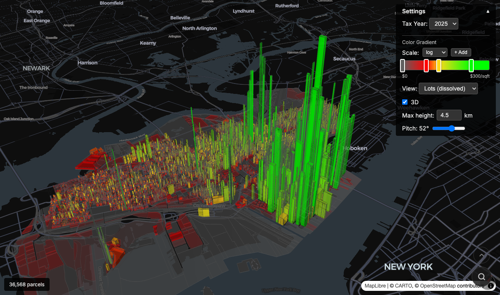

# jc-taxes

Interactive 3D choropleth of Jersey City property tax payments, from 2018 to 2025.

[][jct.rbw.sh]

**Live**: [jct.rbw.sh]

## What it shows

Every property tax payment in Jersey City, visualized as extruded polygons on a map. Color and height encode $/sqft (or $/capita). Parcels can be viewed at five aggregation levels: wards, census blocks, tax blocks, dissolved lots, and individual units.

Data is scraped from the [HLS property tax inquiry system][HLS] (70K+ accounts), joined with parcel geometries from [NJGIN] and [JC Open Data], and census population data from [Census TIGER/Line][TIGER].

## Structure

```
src/jc_taxes/       Python package: scrape, process, export
  cli.py            `jct` CLI (enumerate-accounts, fetch, export)
  api.py            HLS API client
  payments.py       Extract yearly payment totals from cached JSONs
  geojson_yearly.py Join payments + geometries → GeoJSON per year/aggregation
  census.py         Census block + ward geometry/population processing
data/               Parcel data, payment caches, parquet exports
census/             Census block geometries, ward boundaries, population
www/                Vite + React web app (see www/README.md)
```

## Data pipeline

```
jct enumerate-accounts   # discover ~70K accounts from parcel block numbers
jct fetch                # fetch account details from HLS (one JSON per account)
jct export               # extract structured data → data/taxes.parquet
python -m jc_taxes.payments      # → data/payments.parquet
python -m jc_taxes.geojson_yearly  # → www/public/taxes-{year}-{agg}.geojson
```

See [DATA-SOURCES.md] for details on each data source.

## Setup

```bash
# Python (data pipeline)
uv sync

# Web app
cd www && pnpm install
```

## Links

- [ROADMAP.md] — shipped features and future plans
- [DATA-SOURCES.md] — data sources and pipeline details
- [www/README.md](www/README.md) — web app docs

[jct.rbw.sh]: https://jct.rbw.sh/
[HLS]: https://apps.hlssystems.com/JerseyCity/PropertyTaxInquiry
[NJGIN]: https://njgin.nj.gov/
[JC Open Data]: https://data.jerseycitynj.gov/
[TIGER]: https://www.census.gov/geographies/mapping-files/time-series/geo/tiger-line-file.html
[ROADMAP.md]: ROADMAP.md
[DATA-SOURCES.md]: DATA-SOURCES.md

---

https://github.com/user-attachments/assets/16ee2158-be12-4e8d-82b4-5b21ff8682c7

**[Try it live →][jct.rbw.sh]**

